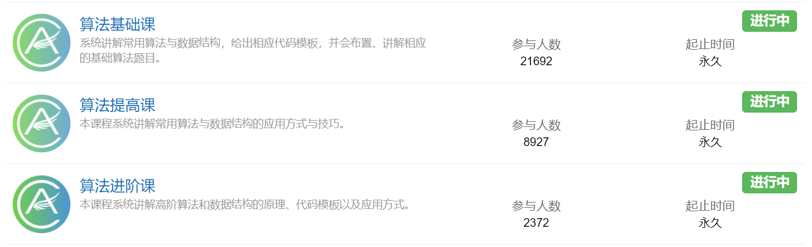
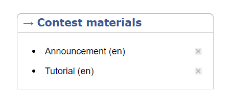

# XCPC 养成计划

## 前言

> 

## 比赛

### ICPC 区域赛

### CCPC 区域赛

### 团体程序设计天梯赛

## 学习路线

## 学习资源

> 这个项目下是在学习 XCPC 竞赛时一些有用的学习资源（网站、博客）

### 工具类网站

- 赛事信息：[News - XCPCIO](https://xcpcio.com/)
  - 可以在 ICPC/CCPC 栏下找到关于区域赛的信息
- 赛事榜单：[Board - XCPCIO](https://board.xcpcio.com/)
  - 可以在这里找到  ICPC/CCPC 赛事的榜单

- 算法wiki：[OI Wiki (oi-wiki.org)](https://oi-wiki.org/)
- 数列查询：[The On-Line Encyclopedia of Integer Sequences® (OEIS®)](http://oeis.org/)
  - 在网站搜索页面输入数列的名称(英文)或者直接输入数列的一部分查询数列通项公式
  - 离线版本（有条件可以淘宝打印在比赛中使用）：[africamonkey/OEIS-Spider: OEIS爬虫 (github.com)](https://github.com/africamonkey/OEIS-Spider)

- 《算法竞赛进阶指南》配套学习资料：[算法竞赛进阶指南](https://active.clewm.net/BR0hXu?qrurl=http://c3.clewm.net/BR0hXu&gtype=1&key=8bfd1166d5264ea7c3989515e774cd74ac84871282)
- 云剪贴板（用于分享代码）
  - [洛谷](https://www.luogu.com.cn/paste)

- [OverLeaf](https://cn.overleaf.com/) ：使用 LaTex 构建自己的模板使用
- [LaTeX常用符号与语法](https://blog.csdn.net/ShadyPi/article/details/83049219) ：写博客，构建模板使用

### 习题和训练网站

- [Acwing](https://www.acwing.com/)：强烈推荐，在活动页面的算法基础课、提高课适合 XCPC 入门使用，讲解细致同时有配套习题

- [Virtual Judge (vjudge.net)](https://vjudge.net/)：集合了多个 OJ 的网站，使用一个账号就可以远程提交多个 OJ 的习题，非常方便找题和组题
- [Codeforces](https://codeforces.com/)：较好的思维训练习题网站，可以以此为主刷题并参加 Contest 中的比赛，在非最新题目的右下角的 `Tutorial`  处可以看到英文题解
  - [Codeforces游玩攻略](https://www.luogu.com.cn/blog/ezoixx130/codeforces-tutorial)

- [AtCoder](https://atcoder.jp/)：日本思维训练习题网站，特点是题面英文较短，Contest 中前 3 题的思维难度比 Coderforces 低
  - [AtCoder从小白到大神的进阶攻略](https://www.luogu.com.cn/blog/LHYLHY/AtCoder)
  - [Dropbox - atcoder_testcases](https://www.dropbox.com/sh/nx3tnilzqz7df8a/AAAYlTq2tiEHl5hsESw6-yfLa?dl=0) ：AtCoder 非最新比赛的有关测试数据（需要 VPN）
- [Gym - Codeforces](https://codeforces.com/gyms)：有许多出题人会将区域赛题目放在这里来供大家练习
- [牛客](https://ac.nowcoder.com/acm/home)：需要关注的是每年的暑假多校，一般预示着当年区域赛的难度水平，同时在牛客暑期多校群里通常都有大神/出题人出没解答问题以及赛事的最新信息

## 博客编写

## 模板构建