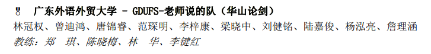

## 2021 天梯赛申报

| 项目         |                                   |
| ------------ | --------------------------------- |
| 竞赛名称     | 团体程序设计天梯赛                |
| 报名时间     | 2021/3/27                         |
| 比赛时间     | 2021/4/24                         |
| 竞赛等级     | 全国性行业机构A                   |
| 主办单位     | 全国高等学校计算机教育研究会      |
| 组织单位类型 | 学会                              |
| 网址         | https://gplt.patest.cn/regulation |

	

### 指导老师

| 姓名   | 职称       | 电话        |
| ------ | ---------- | ----------- |
| 郑琪   | 副教授     | 13660478046 |
| 陈晓梅 | 副教授     |             |
| 林华   | 讲师       |             |
| 李键红 | 助理研究员 |             |

